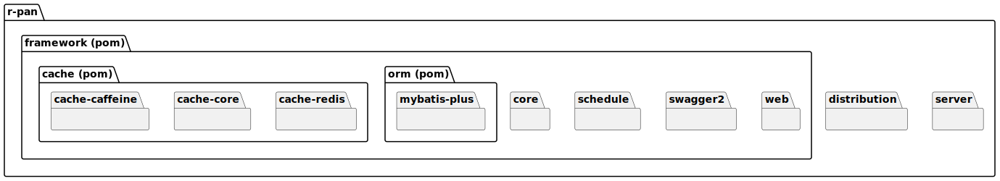
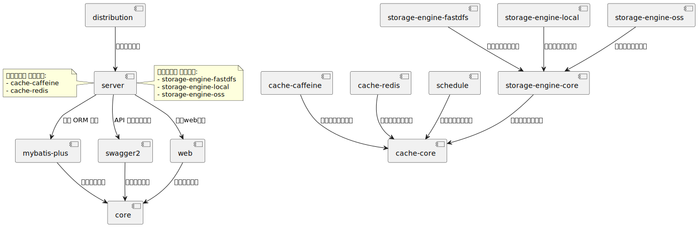

# r-pan

## 项目简介 📁

这是一个简单的网上云盘系统。

## 目录结构 🗂️

1. **distribution**: 打包模块。包含打包脚本、配置等。
2. **framework** (pom): 技术框架管理模块。包含非业务代码的技术框架配置等。
    1. **cache** (pom): 缓存管理模块。
        - **cache-caffeine**: 基于 Caffeine 的本地缓存实现。
        - **cache-core**: 公用的缓存模块，定义了相关常量配置。
        - **cache-redis**: 基于 Redis 的缓存实现。
    2. **core**: 核心公共模块。包含全局的常量类和工具类。
    3. **orm** (pom): ORM 框架管理模块。
        - **mybatis-plus**: MyBatis Plus 的实现，包含配置类和代码生成器。
    4. **schedule**: 定时任务模块。包含定时任务配置。
    5. **swagger2**: 后端项目的 API 文档模块。
    6. **web**: 后端服务的主要框架模块，继承了 Spring Web，处理了通用的跨域、日志、序列化、参数校验等问题。
3. **server**: 后端服务模块。包含主要的业务代码。  
     
   通过这些层次分明的模块化设计，可以确保系统具有良好的扩展性和可维护性。

## 引用关系 🗂️

distribution -> server  
cache-caffeine -> cache-core  
cache-redis -> cache-core  
mybatis-plus -> core  
schedule -> cache-core  
swagger2 -> core  
web -> core  
server -> web/mybatis-plus/swagger2  

更新于 2024-09-30

