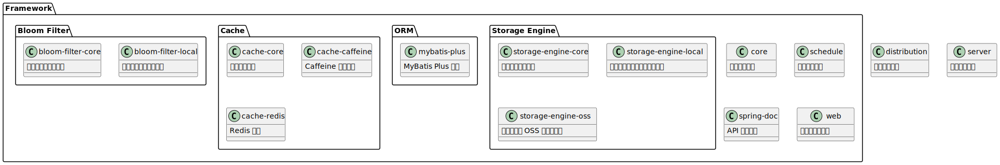
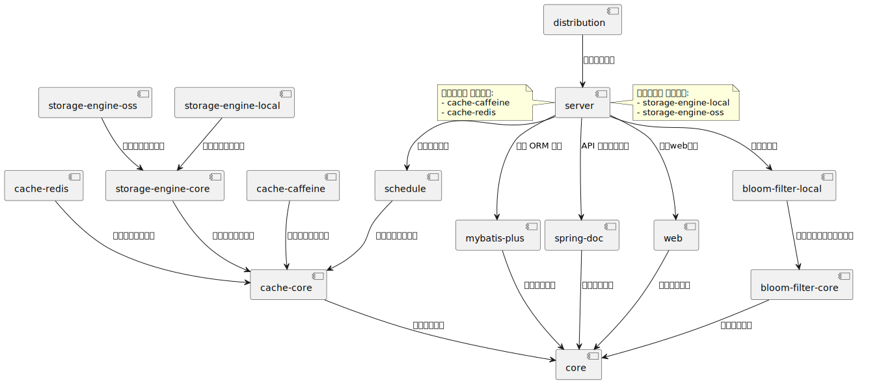

# r-pan

## 项目简介

这是一个简单的网上云盘系统

## 组织结构

1. **distribution**: 打包模块. 包含打包脚本和配置等
2. **framework** (pom): 技术框架管理模块. 包含非业务代码的技术框架配置等
    1. **bloom-filter**(pom): 布隆过滤器管理模块
        - **bloom-filter-core**: 布隆过滤器通用模块
        - **bloom-filter-local**: 本地的布隆过滤器实现
    2. **cache** (pom): 缓存管理模块
        - **cache-caffeine**: 基于 Caffeine 的本地缓存实现
        - **cache-core**: 公用的缓存模块, 定义了相关常量配置
        - **cache-redis**: 基于 Redis 的缓存
    3. **core**: 核心公共模块. 包含全局的常量类和工具类
    4. **orm** (pom): ORM 框架管理模块
        - **mybatis-plus**: MyBatis Plus 的实现. 包含配置类和代码生成器
    5. **schedule**: 定时任务模块. 包含定时任务配置
    6. **spring-doc**: 后端的 API 文档模块
    7. **storage-engine** (pom): 存储引擎管理模块
        - **storage-engine-core**: 存储引擎公用核心模块, 并且定义了存储引擎的顶级功能接口
        - **storage-engine-local**: 基于本地文件系统的存储引擎
        - **storage-engine-oss**: 基于 `阿里云 OSS` 的存储引擎
    8. **web**: 后端服务的主框架, 继承了 Spring Web, 处理了通用的跨域/日志/序列化/参数校验等问题

3. **server**: 后端服务模块. 包含主要的业务代码


 


<details>
<summary>点击查看 UML 源码</summary>

```uml
@startuml

package "Framework" {
    package "Bloom Filter" {
        class "bloom-filter-core" {
            布隆过滤器通用模块
        }
        class "bloom-filter-local" {
            本地的布隆过滤器实现
        }
    }
    
    package "Cache" {
        class "cache-core" {
            核心缓存模块
        }
        class "cache-caffeine" {
            Caffeine 本地缓存
        }
        class "cache-redis" {
            Redis 缓存
        }
    }
    
    class "core" {
        核心公共模块
    }
    
    package "ORM" {
        class "mybatis-plus" {
            MyBatis Plus 实现
        }
    }
    
    class "schedule" {
        定时任务模块
    }
    
    package "Storage Engine" {
        class "storage-engine-core" {
            核心存储引擎模块
        }
        class "storage-engine-local" {
            基于本地文件系统的存储引擎
        }
        class "storage-engine-oss" {
            基于阿里云 OSS 的存储引擎
        }
    }
    
    class "spring-doc" {
        API 文档模块
    }

    class "web" {
        后端服务主框架
    }
}

class "distribution" {
    项目打包模块
}

class "server" {
    后端服务模块
}

@enduml
```

</details>


通过这些层次分明的模块化设计, 可以确保系统具有良好的扩展性和可维护性


## 引用关系




<details>
<summary>点击查看 UML 源码</summary>

```uml
@startuml

[distribution] --> [server] : "打包后端服务"

[bloom-filter-core] --> [core] : "依赖核心模块"
[bloom-filter-local] --> [bloom-filter-core] : "依赖通用布隆过滤器模块"

[cache-core] --> [core] : "依赖核心模块"
[cache-caffeine] --> [cache-core] : "依赖公用缓存模块"
[cache-redis] --> [cache-core] : "依赖公用缓存模块"
[schedule] --> [cache-core] : "依赖公用缓存模块"

[mybatis-plus] --> [core] : "依赖核心模块"
[spring-doc] --> [core] : "依赖核心模块"
[web] --> [core] : "依赖核心模块"

[storage-engine-local] --> [storage-engine-core] : "实现存储引擎接口"
[storage-engine-oss] --> [storage-engine-core]:  "实现存储引擎接口"

[storage-engine-core] --> [cache-core]:  "依赖公用缓存模块"

[server] --> [web]:  "通用web处理"
[server] --> [mybatis-plus]:  "选择 ORM 框架"
[server] --> [spring-doc]:  "API 文档生成工具"
[server] --> [bloom-filter-local]:  "布隆过滤器"
[server] --> [schedule]:  "定时任务支持"

note right of server
选择性引用 存储引擎:
- storage-engine-local
- storage-engine-oss
end note

note left of server
选择性引用 缓存方案:
- cache-caffeine
- cache-redis
end note


@enduml
```

</details>


更新于 2024-10-07